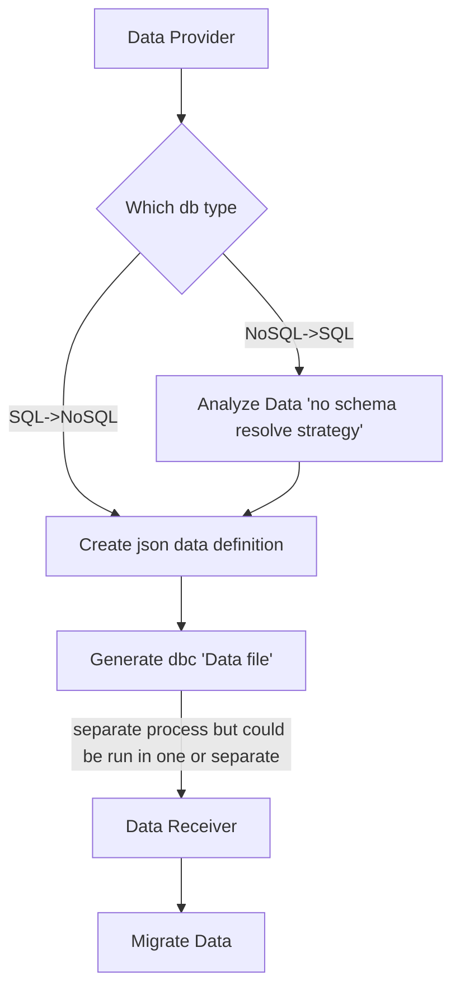

# **Data-mover**

- [**Data-mover**](#data-mover)
  - [Process overview](#process-overview)
    - [Diagrams](#diagrams)
  - [Run](#run)
    - [cargo](#cargo)
    - [docker](#docker)
  - [TODO](#todo)
    - [DB](#db)
      - [Steps of migration](#steps-of-migration)
    - [Migrations](#migrations)
    - [SQL -\> Nosql settings](#sql---nosql-settings)
    - [Functions](#functions)


## Process overview

### Diagrams



## Run

### cargo
todo

### docker
1. Build image
```
docker build -t data-mover .
```

2.Run image
```
TODO
```

## TODO

### DB

#### Steps of migration

| Database    | Generate simple tables from provider | Import to receiver db | Tests |
| ----------- | :----------------------------------: | :-------------------: | :---: |
| Postgressql |       :white_check_mark::star:       |          :x:          |  :x:  |
| Mongodb     |                 :x:                  |    :construction:     |  :x:  |

:star: - Not all type mapped

### Migrations

|             |  Postgressql   |    Mongodb     |
| ----------- | :------------: | :------------: |
| Postgressql |                | :construction: |
| Mongodb     | :construction: |                |


### SQL -> Nosql settings

| Strategy     |    Mongodb     |
| ------------ | :------------: |
| Denormalized | :construction: |
| Normalized   |      :x:       |

### Functions

| Name               | Functionality  |
| ------------------ | :------------: |
| Channels           |      :x:       |
| Data by file       | :construction: |
| Indexes            | :construction: |
| Data by enumerator |      :x:       |
| Migration order    |      :x:       |
